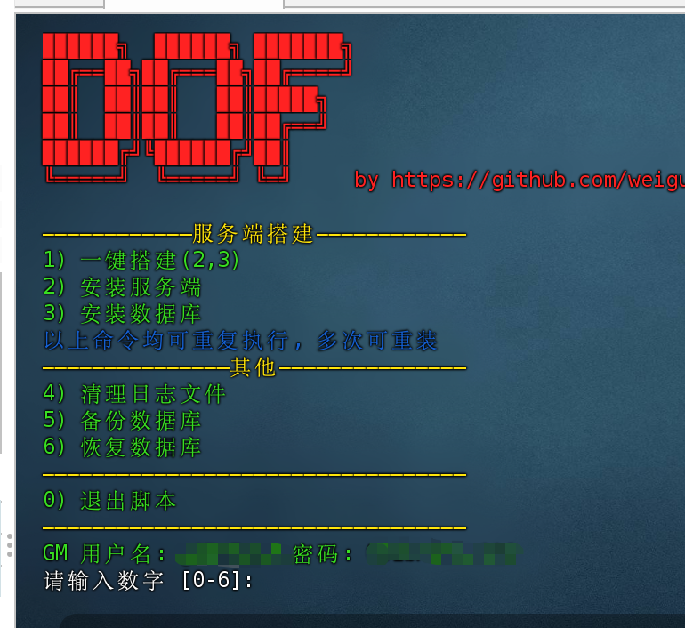

# DOF 一键端

## 概述

基于 [1995chen/dnf](https://github.com/1995chen/dnf)，去 Docker 化(手动[狗头])

默认开启希洛克大区，此脚本不提供 Script.pvf、df_game_r、publickey.pem 以及 dp、frida 配套，有需要自行处理

## 系统适配

- CentOS 7.6 ✅
- CentOS 7.9 ✅

## 功能特性

- 安装服务端
- 安装数据库
- 备份数据库
- 恢复数据库
- 清理日志文件

## 食用指南

### 准备工作

#### 禁用防火墙

简单粗暴，如果有需求可以根据下方列表自行开放端口

```
sudo systemctl stop firewalld
sudo systemctl disable firewalld
```

#### 查看 gm 用户名、密码

安装完成之后，默认会禁用 `game` 用户以 `uu5!^%jg` 默认密码登录数据库，如果有 gm 需求，可以手动查看随机生成的 gm 用户名、密码

```
cd /root && ./dof.sh

```



### 安装服务端

#### 方案一(本地安装)

从 Release 中下载 dof.sh, Game.tar.gz, MySQL.tar.gz 一并上传到/root 目录下, 执行下面这段命令

```bash
chmod +x ./dof.sh && ./dof.sh
```

#### 方案二(联网安装)

```bash
cd /root; curl -o dof.sh https://raw.githubusercontent.com/weiguangchao/dof-install/master/dof.sh && chmod +x ./dof.sh && ./dof.sh
```

### 启动服务端

```bash
cd /root && ./run
```

### 停止服务端

```bash
cd /root && ./stop
```

### 端口汇总

实测需要开放的端口
| 端口 | 类型 | 描述 |
| ----------- | ----------- |----------- |
| 7001 | TCP | df_channel_r 登录端口
| 30011 | TCP | df_game_r[ch.11] 频道端口
| 2311 | UDP | df_stun_r 组队端口

| 端口  | 类型 | 描述             |
| ----- | ---- | ---------------- |
| 3306  | TCP  | MySQL            |
| 7001  | TCP  | df_channel_r     |
| 7001  | UDP  | df_channel_r     |
| 7200  | TCP  | df_relay_r       |
| 7200  | UDP  | df_relay_r       |
| 30011 | TCP  | df_game_r[ch.11] |
| 31011 | UDP  | df_game_r[ch.11] |
| 2311  | UDP  | df_stun_r        |
| 2312  | UDP  | df_stun_r        |
| 2313  | UDP  | df_stun_r        |

## 免责声明

```
本软件完全免费且仅供学习交流，如作他用所承受的法律责任应由使用者本人独自承担，与作者无关（下载使用即代表你同意上述观点）。源文件发布之初安全无病毒，使用者在经任何渠道下载与使用本软件进行学习前请仔细甄别文件是否安全。

虽然支持外网，但是千万别拿来开服。只能拿来学习使用!!!
虽然支持外网，但是千万别拿来开服。只能拿来学习使用!!!
虽然支持外网，但是千万别拿来开服。只能拿来学习使用!!!
```
