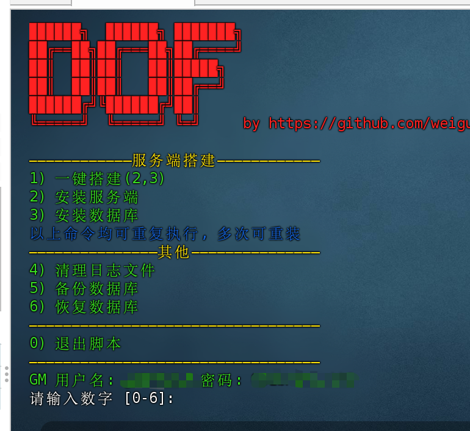

**Languages:** English | [简体中文](README.zh-CN.md)

# DOF One-Click Install

## Overview

Based on [1995chen/dnf](https://github.com/1995chen/dnf), Docker-free deployment.

The Sirocco region is enabled by default. This script does **not** include _Script.pvf_, _launcher_, _publickey.pem_, _df_game_r_, _dp_, or _frida_ — please obtain those separately as needed.

## System Support

- CentOS 7.x ✅

## Features

- Install server
- Install database
- Back up database
- Restore database
- Clean up log files

## Getting Started

### Prerequisites

#### Disable firewall

The simplest approach — if you need finer control, open only the ports listed in the [Ports](#ports) section below.

```
sudo systemctl stop firewalld
sudo systemctl disable firewalld
```

#### View GM username and password

After installation, remote database login for the `game` user with the default password `uu5!^%jg` is disabled. To use GM features, you can look up the randomly generated GM credentials:

```bash
cd /root && ./dof.sh
```



### Install Server

#### Option 1: Local install

**Download**

Download the installation files `dof.sh`, `Game.tar.gz`, and `MySQL.tar.gz` from one of the following sources:

1. Baidu Netdisk link (base64, recommended)

```
6YCa6L+H572R55uY5YiG5Lqr55qE5paH5Lu277yaZG9mLWluc3RhbGwK6ZO+5o6lOiBodHRwczovL3Bhbi5iYWlkdS5jb20vcy8xcnVFdHVVTG9xWVlNWi0zZnAydWRDQT9wd2Q9MnJ5YSDmj5Dlj5bnoIE6IDJyeWEgCi0t5p2l6Ieq55m+5bqm572R55uY6LaF57qn5Lya5ZGYdjHnmoTliIbkuqs=
```

2. GitHub Release

```
https://github.com/weiguangchao/dof-install/releases/tag/1.0
```

**Install**

Upload `dof.sh`, `Game.tar.gz`, and `MySQL.tar.gz` to the `/root` directory, then run:

```bash
chmod +x ./dof.sh && ./dof.sh
```

#### Option 2: Online install

```bash
cd /root; curl -o dof.sh https://raw.githubusercontent.com/weiguangchao/dof-install/master/dof.sh && chmod +x ./dof.sh && ./dof.sh
```

### Start Server

```bash
cd /root && ./run
```

### Stop Server

```bash
cd /root && ./stop
```

### Ports

Minimum ports required:
| Port | Type | Description |
| ----------- | ----------- | ----------- |
| 7001 | TCP | df_channel_r — server selection |
| 30011 | TCP | df_game_r[ch.11] — channel |

For party play, you only need to open one `df_stun_r` port, e.g. port 2311.

All ports:
| Port | Type | Description |
| ----- | ---- | ---------------- |
| 3306 | TCP | MySQL |
| 7001 | TCP | df_channel_r — server selection |
| 30011 | TCP | df_game_r[ch.11] — channel |
| 2311 | UDP | df_stun_r — party |
| 2312 | UDP | df_stun_r — party |
| 2313 | UDP | df_stun_r — party |

## FAQ

### What if I entered the wrong server IP?

Update the value to the correct IP in the following config files:

- `this_ip` in `/home/neople/channel/cfg/channel.cfg`
- `ip` and `stun_ip` in `/home/neople/game/cfg/<channel-name>.cfg`

## Disclaimer

```
This software is completely free and intended for learning and exchange purposes only.
Any legal liability arising from other uses shall be borne solely by the user and has
nothing to do with the author (downloading and using constitutes agreement to the above).
The source files were safe and virus-free at the time of release; please verify the
integrity of any file before downloading from any channel.

External network access is supported, but DO NOT use this to run a public server. For learning only!!!
External network access is supported, but DO NOT use this to run a public server. For learning only!!!
External network access is supported, but DO NOT use this to run a public server. For learning only!!!
```

## License

[MIT](LICENSE) © 2025 wggc
